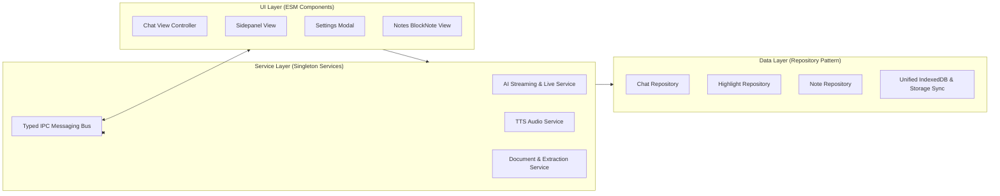

# Lumina Extension - Architectural Analysis Report (Understand-Anything)

**Date**: 2026-08-27T02:55:12.370Z  
**Total AST Nodes**: 287 | **Total Edges**: 261 | **Files Analyzed**: 50

---

## 1. Executive Summary & Problem Statement

Codebase hiện tại của **Lumina** là một Chrome Extension Manifest V3 giàu tính năng (Gemini Live Audio, Streaming Chat, BlockNote Notes, Highlights, PDF/YouTube extraction, TTS), tuy nhiên đang gặp phải các vấn đề kiến trúc nghiêm trọng:

1. **Monolithic Bundle qua Script Nối Chuỗi (`build.ps1`):**
   - Không sử dụng module bundler thực thụ (như Vite/ESM).
   - Toàn bộ các file trong `lib/` và `pages/` được nối chuỗi phẳng vào `lumina.bundle.js` và `lumina.bundle.css`.
   - Tất cả các hàm, biến dùng chung đều biến thành **global variables** trên `window`, gây ô nhiễm scope và nguy cơ xung đột tên rất cao.

2. **File Monolithic Quá Lớn:**
   - `pages/lumina/lumina.js`: **6,000+ dòng code** chứa lẫn lộn: DOM Event listeners, UI rendering, WebSocket handling, API streaming, Markdown parsing, Speech synthesis triggering, Storage access, File upload handling.
   - `pages/lumina/lumina.css`: **6,400+ dòng code** styling gộp chung không theo design tokens hay BEM/CSS modules.

3. **Thiếu Phân Tách Tầng (Layered Separation):**
   - Giao diện (View) gọi trực tiếp xuống tầng lưu trữ (IndexedDB/Storage) và khởi tạo API WebSocket ngay bên trong UI handler.
   - Giao tiếp giữa `content.js` <-> `background.js` <-> `lumina.js` dùng raw JSON messages thiếu Type Definitions, khó debug và dễ gãy khi thêm tính năng mới.

---

## 2. Bản Đồ Phân Tầng Hiện Tại (Current Layer Breakdown)

### 🔹 Layer 1: Extension Lifecycle & Background (Entrypoints)
- **`manifest.json`**: Định nghĩa permissions (storage, scripting, offscreen, tts, sidePanel), content security policy, commands (`open-lumina-chat`, `new-chat`, `toggle-side-panel`).
- **`scripts/background.js`**: Quản lý Service Worker lifecycle, sidepanel opening, offscreen document audio context setup.
- **`pages/offscreen/offscreen.js`**: Offscreen document hỗ trợ phát và thu âm thanh nền cho Manifest V3.

### 🔹 Layer 2: Content Scripts & Web Page Injections
- **`scripts/content.js`**: Lắng nghe sự kiện bôi đen (selection), click context menu, trigger popup dịch thuật / giải thích.
- **`lib/helpers/selection_utils.js` & `lib/helpers/annotation_utils.js`**: Lấy tọa độ selection, highlight chữ trên web page.
- **`lib/ui/dictionary_popup.js` & `lib/parsers/freedict_parser.js`**: Popup tra từ điển offline.
- **`lib/helpers/youtube_utils.js` & `lib/helpers/file_processor.js`**: Bóc tách transcript video và file PDF/Docs.

### 🔹 Layer 3: AI Engine & Realtime Audio Services
- **`lib/core/gemini_live.js`**: WebSocket client giao tiếp realtime với Gemini Multimodal Live API.
- **`lib/core/pcm_processor.js`**: Xử lý định dạng PCM 16-bit 24kHz âm thanh 2 chiều.
- **`lib/core/tts_manager.js` & `lib/ui/tts_panel.js`**: Quản lý hàng đợi đọc giọng nói văn bản.
- **`lib/core/token_utils.js` & `lib/core/memory.js`**: Quản lý bộ đệm token và context memory của AI.

### 🔹 Layer 4: Storage & Data Persistence (IndexedDB)
- **`lib/core/chat_db.js` & `lib/core/chat_history.js`**: Quản lý thread hội thoại và message history.
- **`lib/core/highlight_db.js`**: Quản lý các đoạn bôi vàng trên web.
- **`lib/core/attachment_db.js`**: Lưu trữ cache file đa phương tiện (ảnh, PDF).
- **`lib/core/notes_manager.js`**: Quản lý ghi chú tích hợp BlockNote editor.
- **`lib/core/migration.js`**: Di chuyển dữ liệu giữa các phiên bản extension.

### 🔹 Layer 5: Presentation & Workspace UI
- **`pages/lumina/lumina.html` / `lumina.js` / `lumina.css`**: Giao diện chat chính, action bar, markdown renderer, chat bubbles, sparks prompts.
- **`pages/lumina/settings_modal.js`**: Modal cài đặt API key, model configurations, system prompts.
- **`pages/lumina/search_modal.js`**: Modal tìm kiếm tin nhắn và ghi chú.

---

## 3. Lộ Trình Module Hoá Cho Phase 2 Đến Phase 7

Dựa trên kết quả Knowledge Graph thu được, dự án hoàn toàn sẵn sàng để bước sang **Phase 2: Thiết lập Modern Build Pipeline (Vite + TypeScript/ESM)** để thay thế hoàn toàn `build.ps1`.
