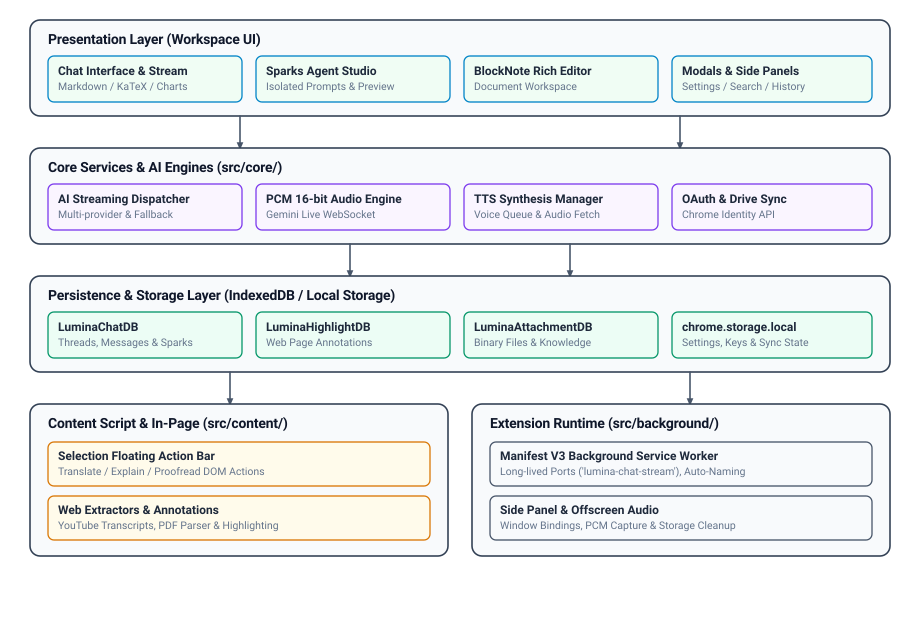

# Lumina Extension - Architectural Analysis Report (Understand-Anything)

**Date**: 2026-08-27T15:05:00.000Z  
**Total Source Files**: 83 | **Architecture Version**: 2.0 (Modular ESM + esbuild)  
**Target Platform**: Google Chrome Extension (Manifest V3)

---

## 1. Executive Summary & Architectural Overview

Lumina is a privacy-first, multi-tier Chrome Extension (Manifest V3) providing an extensible AI workspace, multimodal audio streaming, in-page contextual actions, isolated custom agents (Sparks), block-based rich notes, and local-first data storage with Google Drive synchronization.

The codebase has transitioned from a legacy monolithic script-concatenation pattern into a modern, domain-driven modular architecture built with **esbuild**, featuring strict separation between UI components, background service workers, audio processing pipelines, and data access repositories.

### Key Architectural Characteristics
- **Modular Bundling with esbuild**: Automated bundling pipeline compiling JSX, modern ESM JavaScript, and CSS into isolated distribution targets (`lumina.bundle.js`, `background.bundle.js`, `content.bundle.js`, `lumina.bundle.css`).
- **Domain-Driven Directory Structure**: Core business logic, persistence layers, background services, and UI components are organized into cohesive sub-packages under `src/`.
- **Typed Message Passing & Reactive Streaming**: Long-lived Port connections (`lumina-chat-stream`) and structured runtime messaging decouple the browser background service worker from the workspace views.
- **Local-First Data Sovereignty**: All session histories, API keys, Sparks configurations, and notes reside locally within client-side IndexedDB and `chrome.storage.local`.

---

## 2. Layered Architecture Breakdown



<details>
<summary>D2 Architecture Specification (sketch: true)</summary>

```d2
vars: {
  d2-config: {
    sketch: true
    theme-id: 0
  }
}

presentation_layer: "Presentation Layer (Workspace UI)" {
  chat_ui: "Chat Interface & Stream Renderer\n(Markdown / KaTeX / Charts)"
  sparks_studio: "Sparks Agent Studio\n(Isolated Prompts & Preview)"
  notes_editor: "BlockNote Rich Editor\n(Document Workspace)"
  modals: "Modals & Side Panels\n(Settings / Search / History)"
}

service_layer: "Core Services & AI Engines (src/core/)" {
  ai_stream: "AI Streaming Dispatcher\n(Multi-provider & Key Rotation)"
  audio_engine: "PCM 16-bit 24kHz Audio Engine\n(Gemini Live WebSocket)"
  tts_manager: "TTS Synthesis Manager\n(Voice Queue & Audio Fetch)"
  auth_sync: "OAuth & Drive Sync\n(Chrome Identity API)"
}

persistence_layer: "Persistence Layer (IndexedDB / Local Storage)" {
  chat_db: "LuminaChatDB\n(Threads, Messages & Sparks)"
  highlight_db: "LuminaHighlightDB\n(Web Page Annotations)"
  attachment_db: "LuminaAttachmentDB\n(Binary Files & Knowledge)"
  storage_local: "chrome.storage.local\n(Settings, Keys & Sync State)"
}

content_layer: "Content Script & In-Page (src/content/)" {
  action_bar: "Selection Floating Action Bar\n(Translate / Explain / Proofread)"
  extractors: "Web Extractors & Annotations\n(YouTube Transcripts, PDF Parser)"
}

runtime_layer: "Extension Runtime (src/background/)" {
  service_worker: "Manifest V3 Background Worker\n(Long-lived Ports, Auto-Naming)"
  sidepanel_offscreen: "Side Panel & Offscreen Audio\n(Window Bindings, PCM Capture)"
}

presentation_layer -> service_layer: Invokes services
service_layer -> persistence_layer: Stores & retrieves
presentation_layer -> persistence_layer: Reads cache
content_layer <-> runtime_layer: Bi-directional IPC
service_layer <-> runtime_layer: Port streaming
```
</details>

### Layer 1: Extension Lifecycle & Background Runtime (`src/background/`)
- **`src/background/index.js`**: Service worker entry point initializing all background subsystems on startup.
- **`src/background/chat_stream_service.js`**: Central AI streaming dispatcher. Handles multi-provider API requests (Gemini, OpenAI, Claude, Groq, OpenRouter, Ollama), API key rotation, concurrent auto-naming, and stream broadcast channels.
- **`src/background/sidepanel_manager.js`**: Manages Chrome Side Panel states, window bindings, and tab transitions.
- **`src/background/sync_handlers.js`**: Executes debounced Google Drive synchronization, backup serialization, and conflict resolution.
- **`src/background/media_processor.js`**: Processes file attachments, base64 conversions, and image MIME-type normalization.
- **`src/background/audio_fetcher.js`**: Background fetcher for remote pronunciations and audio streams.
- **`src/background/storage_cleanup.js`**: Periodic cleanup routines for expired temporary cache entries.

### Layer 2: Content Scripts & In-Page Injections (`src/content/`, `src/helpers/`)
- **`src/content/content_script.js`**: Injected script capturing selection ranges, mouse events, and keyboard shortcuts.
- **`src/content/selection_toolbar.js`**: Floating contextual action bar offering translation, definition lookup, summarization, and prompt execution.
- **`src/content/annotation_manager.js`**: In-page highlighter injecting DOM spans with persistent color coding and note anchors.
- **`src/helpers/selection_utils.js`**: DOM range calculation, scroll compensation, and viewport bounding logic.
- **`src/helpers/youtube_utils.js`**: YouTube transcript extractor and timestamp synchronizer.
- **`src/helpers/file_processor.js`**: Client-side parsing for PDF files, text documents, and code extracts.

### Layer 3: Core Services & AI Engines (`src/core/`)
- **`src/core/audio/pcm_processor.js`**: Handles raw PCM 16-bit 24kHz bidirectional audio conversion for low-latency voice streaming.
- **`src/core/audio/gemini_live.js`**: WebSocket client managing real-time bidirectional multimodal interaction with Google Gemini Live API.
- **`src/core/audio/tts_manager.js`**: Synthesizes and queues browser text-to-speech outputs with configurable rate, pitch, and voice profiles.
- **`src/core/auth/google_auth.js`**: Chrome Identity API wrapper handling OAuth2 authentication, token refresh, and user profile retrieval.
- **`src/core/memory/user_memory.js`**: Contextual memory indexing injecting user preferences and persistent facts into LLM system prompts.
- **`src/core/tokens/token_utils.js`**: Token counting and context window trimming across diverse model tokenizers.

### Layer 4: Storage & Persistence Repositories (`src/db/`)
- **`src/db/chat_db.js`**: IndexedDB repository managing chat sessions, messages, version branching, and metadata tags.
- **`src/db/highlight_db.js`**: Stores page URL mappings, annotation ranges, colors, and timestamps.
- **`src/db/attachment_db.js`**: Manages binary blobs for uploaded knowledge files, images, and documents.
- **`src/db/migration.js`**: Schema migration engine executing version upgrades safely without data loss.

### Layer 5: Presentation & Workspace Layer (`src/components/`, `src/pages/`, `src/popup/`)
- **`src/pages/lumina/workspace.js` & `index.js`**: Main workspace controller managing tab states, split pane layouts, prompt dispatching, and layout responsiveness.
- **`src/components/chat/chat_ui.js`**: Chat interface controller handling message rendering, auto-scrolling, markdown parsing, and inline edit actions.
- **`src/components/chat/chart_renderer.js`**: Dynamic Chart.js renderer converting JSON codeblocks into interactive data visualizations.
- **`src/components/sparks/sparks.js`**: Sparks Studio for configuring custom personas, editing system prompts, uploading knowledge attachments, and live-preview testing.
- **`src/components/notes/notes_manager.js`**: Integrated BlockNote document editor with rich-text formatting and markdown interoperability.
- **`src/components/modals/`**: Modular overlays for Settings (`settings_modal.js`), Quick Search (`search_modal.js`), and History (`history_panel.js`).
- **`src/pages/lumina/styles/`**: Modular CSS design system built on custom tokens (`tokens.css`, `base.css`, `layout.css`, `lumina.css`).

---

## 3. Communication & Data Flow Pipelines

### AI Streaming Message Pipeline
```
[User Input in Workspace UI]
           │
           ▼
  handleSubmit() in workspace.js
           │
           │  port.postMessage({ action: 'chat_stream', ... })
           ▼
[Background Port: 'lumina-chat-stream']
           │
           ▼
  handleChatStream() in chat_stream_service.js
           │
           ├── Key Rotation & Model Chain Resolution
           ├── Build Context & System Instructions
           └── fetch(Provider API Endpoint, { stream: true })
           │
           ▼
  ReadableStream Loop
           │
           │  broadcastToSession(sessionId, { action: 'chunk', chunk })
           ▼
[Workspace UI Port Listener]
           │
           ▼
  chatUI.appendAssistantChunk() -> Marked Renderer -> DOM Update
```

### Auto-Naming & Session Lifecycle Flow
```
First User Message Sent
           │
           ├── Generate unique SessionID
           ├── Initialize Session in Memory & Tabs
           │
           ├── Send Stream Request (chat_stream)
           │
           └── chrome.runtime.sendMessage({ action: 'generate_chat_title' })
                      │
                      ▼
             Background Service Worker (chat_stream_service.js)
                      │
                      ├── Call lightweight LLM with Title Prompt
                      └── Return response { success: true, title: "..." }
                      │
                      ▼
             Update Tab Title & Persist in LuminaChatDB
```

---

## 4. Build Pipeline Architecture

```
src/pages/lumina/index.js           ──(esbuild)──>  pages/lumina/lumina.bundle.js
src/pages/lumina/styles/index.css   ──(esbuild)──>  pages/lumina/lumina.bundle.css
src/background/index.js             ──(esbuild)──>  scripts/background.bundle.js
src/content/content_script.js       ──(esbuild)──>  scripts/content.bundle.js
tools/blocknote_entry.jsx           ──(esbuild)──>  lib/vendor/blocknote.js
```

---

## 5. Architectural Quality Matrix

| Dimension | Current Implementation | Rating |
|---|---|---|
| **Separation of Concerns** | Domain-separated layers (`background`, `core`, `db`, `components`, `helpers`). | High |
| **Persistence Sovereignty** | Local-first IndexedDB with optional OAuth-backed cloud synchronization. | High |
| **Extensibility** | Modular model adapter pattern; pluggable custom Sparks agents. | High |
| **Resilience & Fault Tolerance** | Automatic API key rotation, provider fallback chains, and network reconnect logic. | High |
| **Build Optimization** | High-speed bundle compilation via `esbuild` with hot-reload watch capabilities. | High |

---

*Report automatically compiled and formatted for architectural documentation.*
